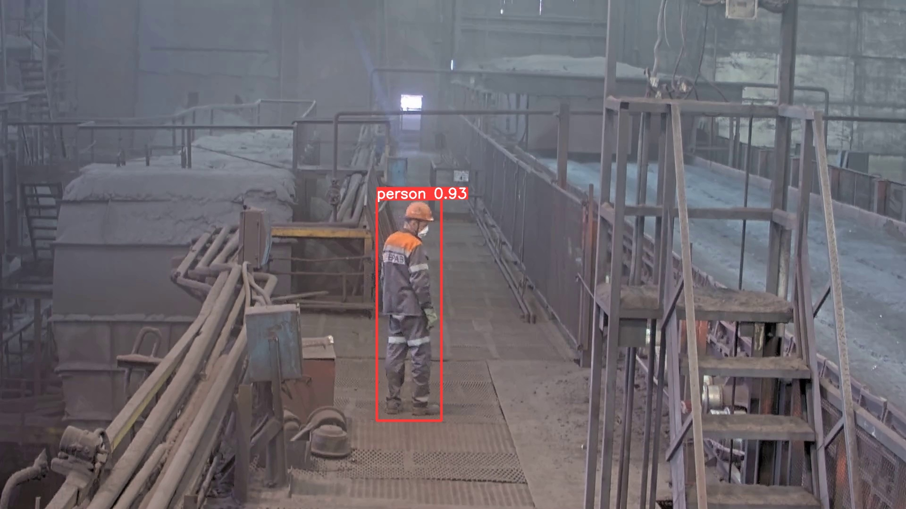

# 
EVRAZ AI Challenge

### 
Работа в области компьютерного зрения в рамках хакатона EVRAZ AI Challenge

Целью хакатона является обучение модели для обнаружения рабочих на производстве.

Для обучения использовалась модель Yolov5m с предобученными весами.
